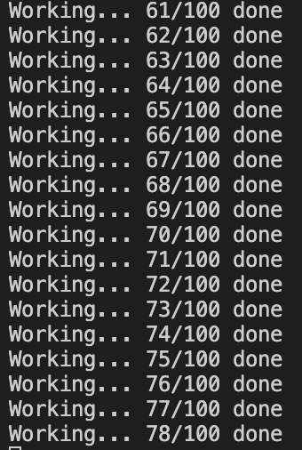

### Example 1

In this example, if the background function `some_work()` is sleeping for a long time, the `stop` command in between will need to wait for the background thread to complete its job. This is great for background worker queues, but probably not for user-facing programs.

### Example 2

In this case, it can still take the last full second for the main thread to realize even if the spawned threads completes. To address this, we can use `parks`, which is coming in example 3.

### Example 3

Even if the main thread is sleeping for a maximum of 200 seconds, every time the worker completes its current job it `unparks` (signals) it. So, after every background job (taking ~1s), the main threads is signaled, wakes up, and prints the progress.

### Example 4

In this example, we are filling static data with the needed value (page size, OS version etc, so really static data) that must be shared between all threads as a read-only after the initial write.

While on thread is calculating the value for the static, other threads can also see it undefined and get into the same task, so they'll be overwriting each other with the same value - causing a race (not a data race, obviously, and don't forget that data races are not allowed in Rust unless `unsafe` code). Yet, this is still a race with an unknown winner. To avoid this, implementing mutex and CV is much work, Rust already implements `std::sync::Once` and `std::sync::OnceLock` but I didn't add code with them here.

### Example 5

Notes in the file. There are some important notes in the file, such as the `&AtomicUSize` now defined as a reference, since we use `move` when spawning (so that threads know their own data) and `we cannot copy AtomicUSize` as that would 1) oppose the idea of using atomics, naturally 2) be forbidden by Rust after the second trait moving it since `Copy` trait is not implement for `Atomic` types in Rust.

### Example 6

There would be some underestimations and overestimations possible in the statistics. The main thread can load the values after a thread updates `total_time` but before `max_time` etc. The ideal thing would be to signal the main thread after each four threads are done with their same `i`, but this would oppose ideal concurrency in tasks of variable length-jobs. I'm not sure about the ideal way to get stats in such an environment. They can be locked in mutexes to make all three updates atomic, but at the expense of locking. So...

Also, the timers under `std::time` are likely system calls, so this won't be sensitive. But this is not the main focus here.

### Example 7

Examples here don't fully satisfy the need `unique id allocation`, but it leads to the solution proposed in example 8.

### Example 8

Includes the code to make new ID allocation with atomic conditionals. Another way is using `fetch-update`, which is not covered in this book but can be looked up.

### Example 9

Multiple threads might attempt to generate a new key, but excetpt the first, none will be able to update the global static `KEY`. If you run multiple times, the logs will show you the attempts per thread, but each will end up with the globally defined one.
